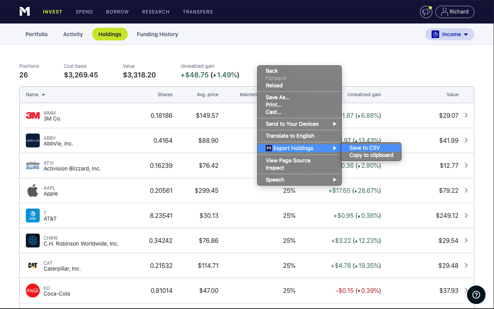
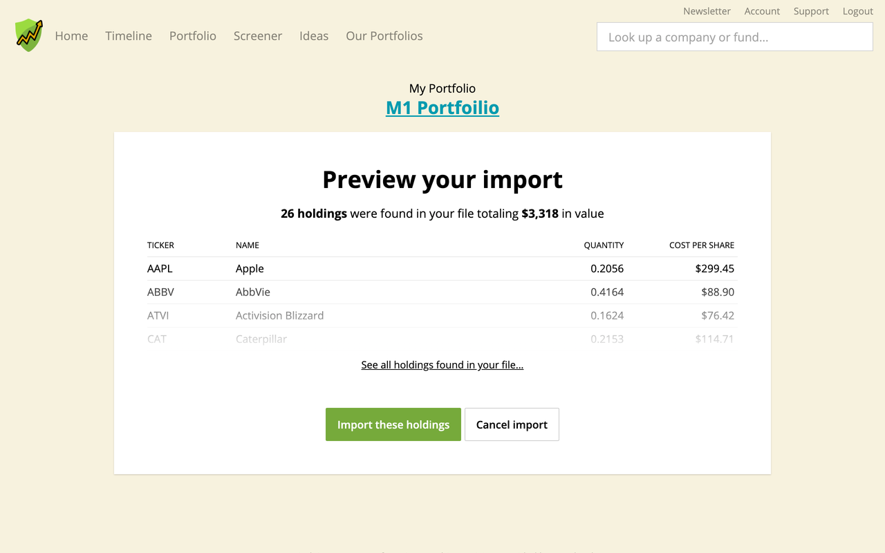

#  M1 Export - Chrome Extension

Copy M1 finance portfolio to a CSV or to the clipboard.

Now you can easliy upload it to [simply safe dividends](simplysafedividends.com)

## How to Install

1. [Download Zip](https://github.com/RichardMcSorley/M1-Export-Chrome-Extension/archive/master.zip)  and unzip to an easy to find location.

2. In Chrome the  Menu -> More tools -> Extensions -> Enable "Developer mode".

3. Finally click “Load unpacked” and find where you saved the unzipped folder.

## How to Use

1. Login to [M1 Finance](https://m1.finance)

2. Holdings ->  Right click anywhere on the page -> Copy/Save Holdings -> Save to CSV

3. ??? / Load into [simply safe dividends](simplysafedividends.com)

4. Profit

